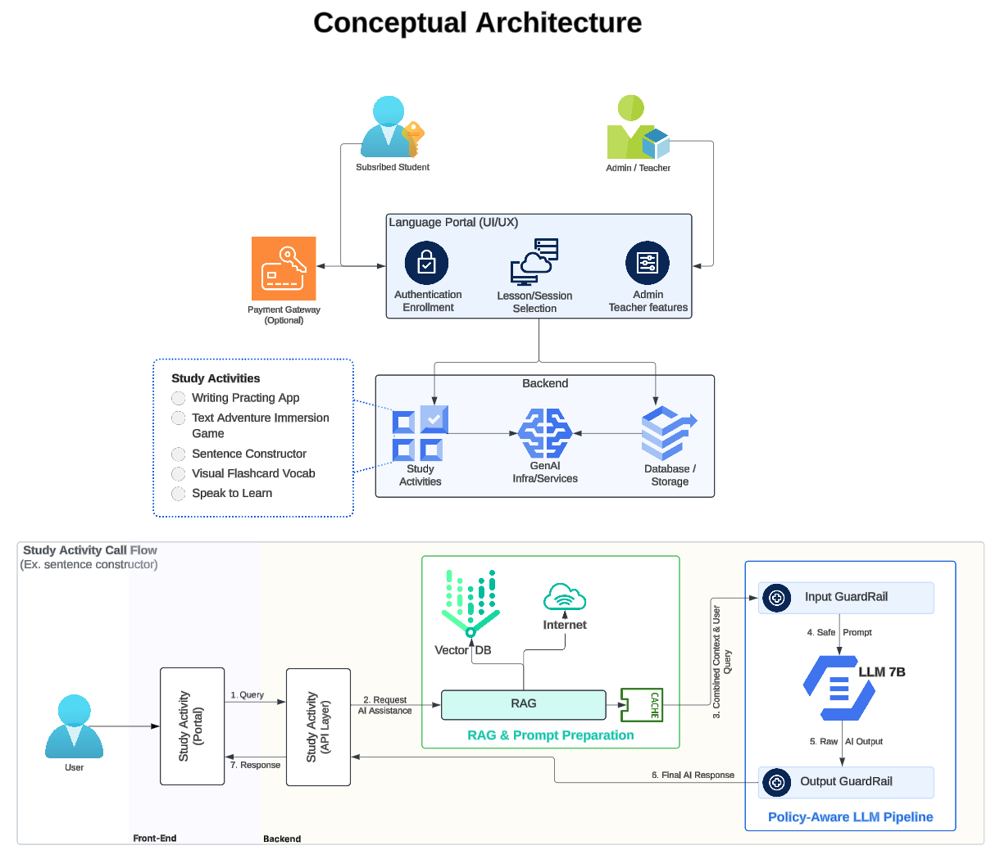

# GenAI Language-Learning Platform - Architecture & Design Considerations

This repository provides the **architecture and design considerations** for our **GenAI-powered language-learning** environment. The primary audience includes solution architects, AI engineers, and key stakeholders who need to understand the **high-level system** and **key technical decisions**.

---

## 1. Introduction

We aim to deliver **interactive, AI-driven** language-learning experiences—ranging from **text adventures** to **speaking practice**—to approximately **700 students** located in and around **Fukuoka**. Given institutional concerns about **data privacy** and **long-term costs**, we have opted to:

- **Self-host** an **open-source LLM** on an **on-premises GPU** server.  
- Use a **Retrieval-Augmented Generation (RAG)** approach to provide domain-specific context (e.g., grammar rules, curated vocab).  
- Implement **guardrails** for input/output filtering to ensure safe and policy-compliant AI responses.

---

## 2. Conceptual Architecture

Below is the **high-level conceptual diagram** of our system. It illustrates how users, the Language Portal, Study Activities, and our AI services interact:

> **Note**: This diagram shows the major components (Portal, Activities, AI & Data Services) and their interactions at a conceptual level.

---

## 3. Key Requirements & Assumptions

### 3.1 Business & Functional Requirements
- **On-Prem Hosting**: Must run the AI components on a locally managed GPU server to maintain data privacy and manage costs.
- **Language Portal**: A centralized UI for **students** (accessing lessons/activities) and **teachers** (managing lessons, reviewing progress).
- **Adaptive Study Activities**: Support multiple AI-driven exercises (writing practice, conversation simulations, flashcards, etc.).
- **Cost Awareness**: Operating budget of **\$12,000–\$15,000** to purchase hardware (GPU, server, storage), with minimal cloud usage.

### 3.2 Non-Functional Requirements
- **Low Latency**: Aim for sub-2-second response time on typical queries to maintain a smooth learning experience.
- **Scalability**: Architecture should accommodate up to 700 concurrent users, with the possibility of modest expansion in the future.
- **Security & Data Sovereignty**: All user data and copyrighted resources remain stored on-site or in an encrypted backup.

### 3.3 Assumptions
- **Open-Source LLM**: A known, community-backed model (e.g., **Llama 3**) will provide acceptable accuracy and can run on a single GPU workstation.
- **Network Bandwidth**: Sufficient office broadband to handle concurrency and data flows for 700 users.
- **Teacher Involvement**: Teachers can periodically update content and moderate AI outputs, ensuring educational quality.

---

## 4. Data Strategy

1. **Content Repository**  
   - Licensed textbooks and grammar guides are stored locally.  
   - Used by the **RAG** module for domain-specific context (e.g., chunked/embedded text, Q&A).

2. **Student Progress & Analytics**  
   - **Relational or NoSQL database** to track each student’s lessons completed, quiz scores, etc.  
   - Regular backups to an external, secure location (encrypted).

3. **Privacy Controls**  
   - All PII and usage logs are encrypted at rest.  
   - Strict role-based access for teachers, admins, and IT staff.

---

## 5. Model Selection & Policy-Aware Pipeline

- **Selected Model**: **Llama 3 8B**.  
- **Policy-Aware LLM Pipeline**:  
  - **Input Guardrail**: Ensures queries are safe and policy-compliant.  
  - **LLM**: Generates text responses.  
  - **Output Guardrail**: Filters or modifies the LLM output if it violates any content policies.

### RAG Integration
- **Vector DB** (e.g., a local instance of Milvus or FAISS)  
  - Stores embeddings of textbooks, grammar notes, and curated vocabulary sets.  
  - **Retrieval step**: Pull relevant context prior to LLM calls (improving accuracy for domain-specific tasks).

### Caching
- **Prompt/Response Caching**:  
  - Reduces repeated queries for popular lessons or commonly asked questions.  
  - Lowers the GPU load and speeds up responses.

---

## 6. Infrastructure Design

1. **GPU Server**  
   - A single **high-memory GPU** (e.g., NVIDIA RTX 4090 or an equivalent data-center card) housed on-prem.  
   - 64GB–128GB RAM for the server to handle the LLM runtime plus RAG indexing.  
   - Redundant power supply and basic cooling to ensure stability.

2. **Portal & Activities**  
   - Containerized microservices behind a **reverse proxy** (e.g., NGINX or Traefik).  
   - Students and teachers connect via **HTTPS** to access the Portal.

3. **Networking & Security**  
   - Strict firewall rules only exposing essential ports (HTTPS).  
   - Isolated internal network segment for the AI server, connected to the database and vector store.

---

## 7. Monitoring & Optimization

- **Logging & Telemetry**:  
  - Collect AI inference times, GPU utilization, and user query volumes.  
  - Store logs locally or on a minimal cloud analytics platform (optional).
- **Performance Thresholds**:  
  - Alerts if LLM inference exceeds 2 seconds or GPU usage nears 100%.  
  - Tools like Grafana, Prometheus for real-time monitoring.
- **Feedback Loop**:  
  - Teachers can flag incorrect or suboptimal LLM outputs for improvement (e.g., adjusting prompts, updating RAG embeddings).

---

## 8. Conclusion & Next Steps

1. **MVP Rollout**  
   - Configure the on-prem GPU server, deploy Llama 2, and integrate the RAG pipeline.  
   - Launch a pilot with a subset of learners, gather performance metrics, and refine guardrails.
2. **Evaluate Scaling**  
   - If usage grows beyond 700 users, consider adding a second GPU or exploring a hybrid cloud approach.
3. **Ongoing Enhancements**  
   - Explore fine-tuning or switching to a larger Llama 2 variant if accuracy or context window becomes a limiting factor.  
   - Expand teacher/admin portal features for deeper analytics and editing tools.

**Document Version:** 1.0  
**Last Updated:** *2024-02-02*

---

*This architecture is designed to meet our privacy, cost, and educational needs by combining a self-hosted open-source LLM with guardrails and retrieval-based context. Future improvements may involve advanced MLOps practices, additional GPU scaling, or more sophisticated user analytics.* 
