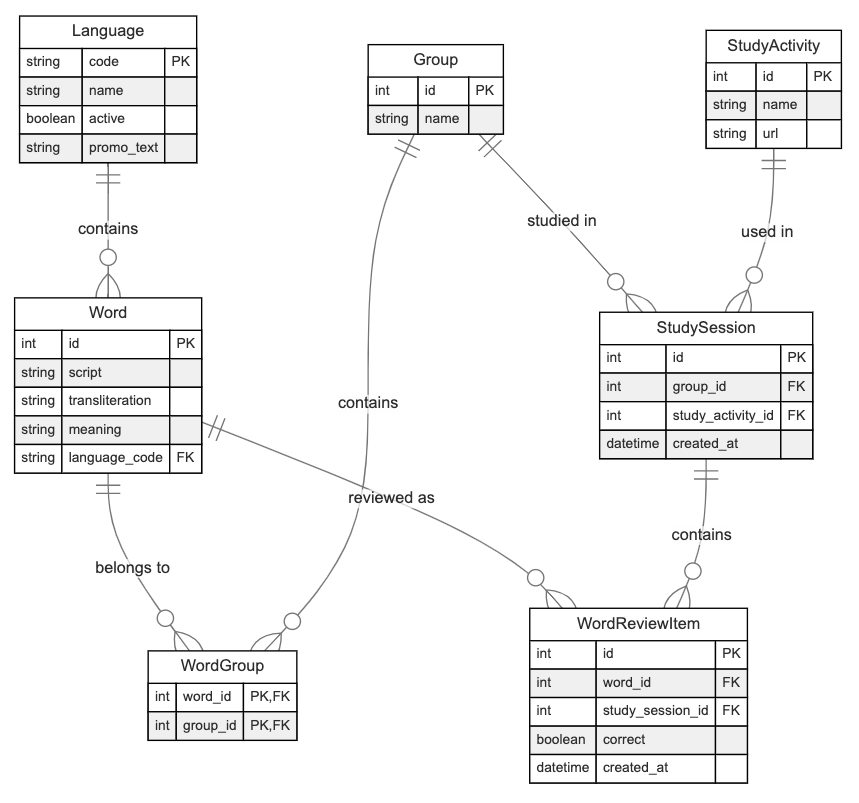
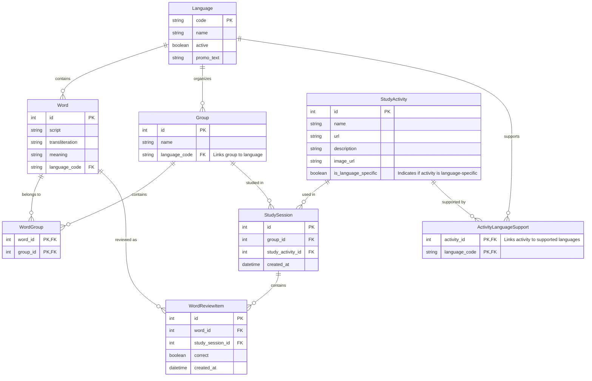

# BACK-END SPECIFICATION

## 1. Title & Overview

This document outlines the **FastAPI + SQLite** back-end for our multi-language learning portal.  
It describes the project structure, database models, endpoints, and a seed/reset mechanism  
to help maintain consistent test data across environments.

## 2. Application Flow & Language Context

### 2.1 Language Selection Flow
1. User lands on the language selection page
2. User selects a language from available active languages
3. Selected language is stored in application context
4. All subsequent operations are performed in the context of the selected language

### 2.2 Language Context Rules
- Words are always associated with a specific language (existing)
- Groups are language-specific to maintain proper organization (new)
- Study activities can be either universal or language-specific (new)
- Study sessions inherit language context from their associated group
- Word reviews maintain language context through their relationship with words

## 3. Project Structure


backend/
├── app/
│   ├── main.py           # FastAPI entry point, middleware for language context
│   ├── database.py       # SQLite connection & session creation
│   ├── models.py         # SQLAlchemy models
│   ├── schemas.py        # Pydantic models for request/response
│   ├── routers/
│   │   ├── languages.py  # Language selection & management
│   │   │                 # - Language selection/switching
│   │   │                 # - Active language filtering
│   │   ├── words.py      # Word management (language-specific)
│   │   │                 # - CRUD operations for words
│   │   │                 # - Word search and filtering
│   │   ├── groups.py     # Group management (language-specific)
│   │   │                 # - CRUD operations for word groups
│   │   │                 # - Group word assignments
│   │   ├── activities.py # Study activities
│   │   │                 # - Universal & language-specific activities
│   │   │                 # - Activity availability by language
│   │   ├── sessions.py   # Study sessions & reviews
│   │   │                 # - Session creation and management
│   │   │                 # - Word review tracking
│   │   └── dashboard.py  # Language-specific statistics
│   │                     # - Progress tracking per language
│   │                     # - Activity success rates
│   │   ├── seed.py           # Data seeding script
│   │   └── utils.py          # Helper functions
│   ├── requirements.txt      # Project dependencies
│   └── README.md            # Project documentation
├── requirements.txt
└── README.md

## 4. Data Models



### Entity Relationship Diagram


We will use **SQLAlchemy** (with SQLite) for our ORM. Below are the main entities:

### 4.1 Language
- **code** (String, PK) – ISO 639-1 code, e.g., "ja", "fr", "es"
- **name** (String, required) – e.g., "Japanese", "French", "Spanish"
- **active** (Boolean, default True) – to enable/disable languages
- **promo_text** (String, optional) – Promotional description of the language
- Relationships:
  - Has many Words (direct)
  - Has many Groups (direct)
  - Supports many StudyActivities (through ActivityLanguageSupport)

### 4.2 Word
- **id** (PK, auto-increment)
- **script** (String, required) – the word in its original script
- **transliteration** (String, optional) – romanization if needed
- **meaning** (String, required) – English translation
- **language_code** (FK → languages.code) – reference to Language
- Relationships:
  - Belongs to one Language
  - Belongs to many Groups (through WordGroup)
  - Has many ReviewItems

### 4.3 Group
- **id** (PK, auto-increment)
- **name** (String, required)
- **language_code** (FK → languages.code) – reference to Language
- Relationships:
  - Belongs to one Language
  - Contains many Words (through WordGroup)
  - Has many StudySessions

### 4.4 WordGroup (Join Table)
- **word_id** (FK → words.id, PK part)
- **group_id** (FK → groups.id, PK part)
- Purpose: Implements many-to-many relationship between Words and Groups
- Note: Composite primary key ensures unique word-group combinations

### 4.5 StudyActivity
- **id** (PK, auto-increment)
- **name** (String, required) – e.g., "Flashcards"
- **url** (String, required) – the relative/absolute URL for the activity
- **description** (String, required) - Detailed description
- **image_url** (String, required) - Activity illustration
- **is_language_specific** (Boolean, default False) - Whether activity is language-specific
- Relationships:
  - Supports specific languages (through ActivityLanguageSupport)
  - Has many StudySessions

### 4.6 ActivityLanguageSupport
- **activity_id** (FK → study_activities.id, PK part)
- **language_code** (FK → languages.code, PK part)
- Purpose: Maps language-specific activities to their supported languages
- Note: Only used when activity's is_language_specific = True

### 4.7 StudySession
- **id** (PK, auto-increment)
- **group_id** (FK → groups.id)
- **study_activity_id** (FK → study_activities.id)
- **created_at** (Timestamp, default now)
- Note: Inherits language context from associated Group

### 4.8 WordReviewItem
- **id** (PK, auto-increment)
- **word_id** (FK → words.id)
- **study_session_id** (FK → study_sessions.id)
- **correct** (Boolean) – indicates whether the user got the word right
- **created_at** (Timestamp, default now)
- Note: Inherits language context from Word

## 5. Endpoints & Logic

### Error Handling

All endpoints follow these error response formats:

#### Standard Error Response
```json
{
    "detail": "Error message describing the issue"
}
```

#### Validation Error Response (FastAPI/Pydantic)
```json
{
    "detail": [
        {
            "loc": ["body", "field_name"],
            "msg": "Field specific error message",
            "type": "value_error"
        }
    ]
}
```

#### Common HTTP Status Codes
- 400: Bad Request (invalid parameters/body)
- 404: Resource Not Found
- 422: Validation Error (Pydantic validation)
- 500: Internal Server Error

### 5.1 Languages
#### GET /languages
Retrieves a list of languages with optional filtering for active/inactive ones.

**Query Parameters:**
- `active` (optional): Boolean - filter active/inactive languages

**Response Format:**
```json
{
    "items": [
        {
            "code": "ja",
            "name": "Japanese",
            "active": true,
            "promo_text": "Explore the rich culture of Japan through its unique writing system..."
        },
        {
            "code": "fr",
            "name": "French",
            "active": true,
            "promo_text": "Delve into the elegant world of French language..."
        }
    ]
}
```

**Example Requests:**
```bash
# Get all languages
GET /languages

# Get only active languages
GET /languages?active=true

# Get inactive languages
GET /languages?active=false
``` 

### 5.2 Words Endpoints

##### GET /words
Retrieves a paginated list of words with their review statistics (aggregated correct/wrong counts).

**Query Parameters:**
- `language_code` (required): ISO 639-1 language code (e.g., "ja", "fr")
- `page` (optional): Page number, default: 1
- `per_page` (optional): Items per page, default: 10
- `sort_by` (optional): Field to sort by (script, transliteration, meaning, correct_count, wrong_count)
- `order` (optional): Sort order ("asc" or "desc"), default: "asc"

**Response Format:**
```json
{
    "total": 25,
    "items": [
        {
            "id": 1,
            "script": "食べる",
            "transliteration": "taberu",
            "meaning": "to eat",
            "stats": {
                "correct_count": 5,
                "wrong_count": 2
            }
        },
        // ... more items
    ],
    "page": 1,
    "per_page": 10
}
```

**Example Requests:**
```bash
# Get first page of Japanese words
GET /words?language_code=ja

# Get second page with 5 items per page
GET /words?language_code=fr&page=2&per_page=5

# Get words sorted by correct answers
GET /words?language_code=ja&sort_by=correct_count&order=desc
```

##### GET /words/{word_id}
Retrieves detailed information about a specific word, including its groups and review statistics.

**Path Parameters:**
- `word_id` (required): Integer - The ID of the word

**Response Format:**
```json
{
    "id": 1,
    "script": "食べる",
    "transliteration": "taberu",
    "meaning": "to eat",
    "stats": {
        "correct_count": 5,
        "wrong_count": 2
    },
    "groups": [
        {
            "id": 1,
            "name": "Core Verbs"
        },
        {
            "id": 3,
            "name": "Food & Drink"
        }
    ]
}
```

**Error Responses:**
- 404: Word not found
  ```json
  {
      "detail": "Word with id {word_id} not found"
  }
  ```

### 5.3 Groups

#### GET /groups
Retrieves a paginated list of groups with their word counts in specified language.

**Query Parameters:**
- `language_code` (required): ISO 639-1 language code (e.g., "ja", "fr")
- `page` (optional): Page number, default: 1
- `per_page` (optional): Items per page, default: 10
- `sort_by` (optional): Field to sort by (name, words_count)
- `order` (optional): Sort order ("asc" or "desc"), default: "asc"

**Response Format:**
```json
{
    "total": 12,
    "items": [
        {
            "id": 1,
            "name": "Core Verbs",
            "words_count": 50
        },
        {
            "id": 2,
            "name": "Food & Drink",
            "words_count": 30
        }
    ],
    "page": 1,
    "per_page": 10
}
```

#### GET /groups/{group_id}
Retrieves detailed information about a specific group and its words. The language context is derived from the group itself.

**Path Parameters:**
- `group_id` (required): Integer - The ID of the group

**Query Parameters:**
- `page` (optional): Page number for words list, default: 1
- `per_page` (optional): Items per page for words list, default: 10
- `sort_by` (optional): Field to sort words by (script, transliteration, meaning, correct_count, wrong_count)
- `order` (optional): Sort order ("asc" or "desc"), default: "asc"

**Response Format:**
```json
{
    "id": 1,
    "name": "Core Verbs",
    "words_count": 25,
    "words": {
        "items": [
            {
                "id": 1,
                "script": "食べる",
                "transliteration": "taberu",
                "meaning": "to eat",
                "stats": {
                    "correct_count": 5,
                    "wrong_count": 2
                }
            }
        ],
        "page": 1,
        "per_page": 10
    }
}
```

**Error Responses:**
- 404: Group not found
  ```json
  {
      "detail": "Group with id {group_id} not found"
  }
  ```

### 5.4 Study Activities

#### GET /study-activities
Retrieves available study activities for a specific language.

**Query Parameters:**
- `language_code` (required): ISO 639-1 language code (e.g., "ja", "fr")

**Response Format:**
```json
{
    "items": [
        {
            "id": 1,
            "name": "Typing Tutor",
            "url": "/study/typing",
            "description": "Practice typing words in their original script",
            "image_url": "/assets/typing-tutor.png"
        },
        {
            "id": 2,
            "name": "Flashcards",
            "url": "/study/flashcards",
            "description": "Review words using digital flashcards",
            "image_url": "/assets/flashcards.png"
        }
    ]
}
```

**Note**: Returns all activities available for the specified language (both universal activities and language-specific ones that support the given language).

#### GET /study-activities/{activity_id}
Retrieves detailed information about a specific study activity, including its sessions history for the specified language.

**Path Parameters:**
- `activity_id` (required): Integer - The ID of the study activity

**Query Parameters:**
- `language_code` (required): ISO 639-1 language code
- `page` (optional): Page number for sessions list, default: 1
- `per_page` (optional): Items per page for sessions list, default: 10
- `sort_by` (optional): Field to sort sessions by (created_at, last_review_at, reviews_count)
- `order` (optional): Sort order ("asc" or "desc"), default: "desc"

**Response Format:**
```json
{
    "id": 1,
    "name": "Typing Tutor",
    "url": "/study/typing",
    "description": "Practice typing words in their original script",
    "image_url": "/assets/typing-tutor.png",
    "sessions": {
        "total": 25,
        "items": [
            {
                "id": 1,
                "group": {
                    "id": 1,
                    "name": "Core Verbs"
                },
                "created_at": "2024-02-16T14:30:00Z",
                "last_review_at": "2024-02-16T14:35:00Z",
                "reviews_count": 20
            }
        ],
        "page": 1,
        "per_page": 10
    }
}
```

**Error Responses:**
- 404: Activity not found
  ```json
  {
      "detail": "Study activity with id {activity_id} not found"
  }
  ```

### 5.5 Study Sessions
#### POST /study-sessions
Creates a new study session.

**Request Body:**
```json
{
    "group_id": 1,
    "study_activity_id": 1
}
```

**Response Format:**
```json
{
    "id": 1,
    "group": {
        "id": 1,
        "name": "Core Verbs"
    },
    "activity": {
        "id": 1,
        "name": "Flashcards"
    },
    "created_at": "2024-02-16T14:30:00Z"
}
```

**Error Responses:**
- 404: Group or Activity not found
- 400: Invalid request body

#### POST /study-sessions/{session_id}/reviews
Records a word review result for the given study session.

**Request Body:**
```json
{
    "word_id": 1,
    "correct": true
}
```

**Response Format:**
```json
{
    "id": 1,
    "word_id": 1,
    "study_session_id": 1,
    "correct": true,
    "created_at": "2024-02-16T14:31:00Z"
}
```

**Error Responses:**
- 404: Session or Word not found
- 400: Invalid request body

#### GET /study-sessions
Retrieves a paginated list of study sessions for the specified language.

**Query Parameters:**
- `language_code` (required): ISO 639-1 language code
- `page` (optional): Page number, default: 1
- `per_page` (optional): Items per page, default: 10
- `sort_by` (optional): Field to sort by (created_at, ended_at)
- `order` (optional): Sort order ("asc" or "desc"), default: "desc"

**Note**: Returns only sessions from groups in the specified language.

**Response Format:**
```json
{
    "total": 100,
    "items": [
        {
            "id": 1,
            "group": {
                "id": 1,
                "name": "Core Verbs"
            },
            "activity": {
                "id": 1,
                "name": "Flashcards"
            },
            "created_at": "2024-02-16T14:30:00Z",
            "last_review_at": "2024-02-16T14:35:00Z",  // Computed from last review
            "reviews_count": 20
        }
    ],
    "page": 1,
    "per_page": 10
}
```

#### GET /study-sessions/{session_id}
Retrieves detailed information about a specific study session, including its words and review results.

**Path Parameters:**
- `session_id` (required): Integer - The ID of the study session

**Query Parameters:**
- `page` (optional): Page number for words list, default: 1
- `per_page` (optional): Items per page for words list, default: 10
- `sort_by` (optional): Field to sort words by (script, correct_count, wrong_count)
- `order` (optional): Sort order ("asc" or "desc"), default: "asc"

**Response Format:**
```json
{
    "id": 1,
    "group": {
        "id": 1,
        "name": "Core Verbs"
    },
    "activity": {
        "id": 1,
        "name": "Flashcards"
    },
    "created_at": "2024-02-16T14:30:00Z",
    "last_review_at": "2024-02-16T14:35:00Z",  // Computed from last review
    "reviews_count": 20,
    "words": {
        "total": 45,  // Total number of words in this session
        "items": [
            {
                "id": 1,
                "script": "食べる",
                "transliteration": "taberu",
                "meaning": "to eat",
                "stats": {
                    "correct_count": 2,
                    "wrong_count": 1
                }
            }
        ],
        "page": 1,
        "per_page": 10
    }
}
```

**Error Responses:**
- 404: Session not found
  ```json
  {
      "detail": "Study session with id {session_id} not found"
  }
  ```

### 5.6 Dashboard

All dashboard endpoints require the language context and return data specific to the selected language.

#### GET /dashboard/last-study-session
Retrieves information about the user's most recent study session.

**Data Source:**
1. Get the most recent `StudySession` by:
   - Join `StudySession` → `Group` → filter by `language_code`
   - Order by `StudySession.created_at` DESC, limit 1
2. Get review statistics by:
   - Count `WordReviewItem` where `study_session_id` matches
   - Group by `correct` field to get correct/wrong counts

**Query Parameters:**
- `language_code` (required): ISO 639-1 language code

**Response Format:**
```json
{
    "activity_name": "Typing Tutor",
    "date": "2024-02-08",
    "stats": {
        "correct_count": 4,
        "wrong_count": 1
    },
    "group": {
        "id": 1,
        "name": "Core Verbs"
    }
}
```

#### GET /dashboard/study-progress
Retrieves the user's study progress over the last month.

**Data Source:**
1. Total words count:
   - Get all groups used in study sessions from last month where `Group.language_code` matches
   - Count total unique words in these groups through `WordGroup` join table
2. Words studied count:
   - Count distinct `Word.id` from `WordReviewItem` → `StudySession` → `Group`
   - Filter by `language_code` and last month's date range
3. Progress percentage:
   - Calculate as `(words_studied / total_words) * 100`

**Query Parameters:**
- `language_code` (required): ISO 639-1 language code

**Response Format:**
```json
{
    "words_studied": 3,
    "total_words": 124,
    "progress_percentage": 2.4  // Calculated as (words_studied/total_words) * 100
}
```

#### GET /dashboard/quick-stats
Retrieves aggregated statistics about the user's study performance.

**Data Source:**
1. Success rate:
   - From `WordReviewItem`, calculate percentage of `correct=True`
   - Join through `StudySession` → `Group` to filter by language
2. Study sessions count:
   - Count distinct `StudySession.id` where `Group.language_code` matches
3. Active groups count:
   - Count distinct `Group.id` from `StudySession` where `language_code` matches
4. Study streak:
   - Get all `StudySession.created_at` dates where `Group.language_code` matches
   - Order by date DESC
   - Count consecutive days from most recent

**Query Parameters:**
- `language_code` (required): ISO 639-1 language code

**Response Format:**
```json
{
    "success_rate": 80,  // Percentage of correct answers across all sessions
    "study_sessions_count": 1,  // Total number of study sessions
    "active_groups_count": 1,   // Number of unique groups used in sessions
    "study_streak": {
        "days": 1,  // Number of consecutive days with study activity
        "last_study_date": "2024-02-08"  // Date of most recent activity
    }
}
```

### Notes on Implementation
1. **Language Context**:
   - All queries must filter by `language_code` through the `Group` relationship
   - This ensures statistics are language-specific

2. **Performance Considerations**:
   - Use appropriate indexes on `created_at`, `language_code`, and foreign keys
   - Consider caching dashboard data with a short TTL (e.g., 5 minutes)
   - Use specific column selection for better query performance

3. **Error Handling**:
   - Handle division by zero in percentage calculations
   - Return appropriate defaults (0, empty lists) when no data exists
   - Validate `language_code` against active languages

4. **Date Handling**:
   - Use UTC for all datetime operations
   - Convert dates to ISO format in responses
   - Consider user's timezone for day boundaries in streak calculation

## 6. Seed & Reset

### 6.1 Seed Data (seed.py)
- Insert default languages (e.g., "ja", "fr", "ar" with their names)
- Insert sample words in various languages (e.g., Japanese, Arabic, French).
- Create default groups ("Core Verbs", "Common Phrases"), link some words via `word_groups`.
- Create sample activities ("Flashcards", "Typing Tutor").

### 6.2 Reset Mechanism
- Could expose an endpoint like `POST /admin/reset` or a CLI that:
  1. Clears session & review tables  
  2. Re-inserts the seed data  
- The front-end "Reset Data" button (in Settings) can call this to restore a baseline state.

## 7. Implementation Guidelines

### 7.1 SQLAlchemy Best Practices

#### Query Optimization
- Use `select()` statements with specific columns instead of querying entire entities
- Leverage `joinedload()` for eager loading of relationships
- Use `selectinload()` for loading collections
- Implement pagination using `limit()` and `offset()`
```python
# Example of optimized query
from sqlalchemy import select
query = select(Word.id, Word.script, Word.meaning).\
    where(Word.language_code == language_code).\
    limit(per_page).offset((page - 1) * per_page)
```

#### Relationship Loading
- Use `relationship()` with `lazy='select'` for default loading
- Specify `lazy='joined'` for frequently accessed relationships
- Use `lazy='dynamic'` for collections that need filtering
```python
# Example in models.py
words = relationship("Word", lazy="select")
groups = relationship("Group", lazy="joined")
reviews = relationship("WordReviewItem", lazy="dynamic")
```

#### Session Management
- Use FastAPI dependency injection for database sessions
- Implement proper session cleanup with context managers
- Handle session rollback on exceptions
```python
# Example of session dependency
def get_db():
    db = SessionLocal()
    try:
        yield db
    finally:
        db.close()
```

### 7.2 SQLite Considerations

#### Concurrency
- Use `PRAGMA journal_mode=WAL` for better concurrent access
- Implement proper connection pooling
- Handle "database is locked" errors with retries
```python
# Example of database configuration
from sqlalchemy import create_engine, event

engine = create_engine(
    "sqlite:///./app.db",
    connect_args={"check_same_thread": False}
)

@event.listens_for(engine, "connect")
def set_sqlite_pragma(dbapi_connection, connection_record):
    cursor = dbapi_connection.cursor()
    cursor.execute("PRAGMA journal_mode=WAL")
    cursor.close()
```

#### Performance
- Create indexes for frequently queried columns
- Use transactions for bulk operations
- Avoid complex joins due to SQLite limitations
```python
# Example of index creation in models
__table_args__ = (
    Index('idx_word_language', 'language_code'),
    Index('idx_group_language', 'language_code'),
)
```

### 7.3 Security Considerations

#### Input Validation
- Use Pydantic models for request validation
- Implement proper type checking
- Validate language codes against available languages
```python
# Example of Pydantic model
class WordCreate(BaseModel):
    script: str
    transliteration: Optional[str]
    meaning: str
    language_code: str

    @validator('language_code')
    def validate_language(cls, v):
        if v not in VALID_LANGUAGE_CODES:
            raise ValueError('Invalid language code')
        return v
```

#### Query Safety
- Use SQLAlchemy's parameterized queries
- Avoid raw SQL statements
- Implement proper error handling
```python
# Example of safe querying
word = db.query(Word).filter(
    Word.id == word_id,
    Word.language_code == language_code
).first()
```

#### Data Access Control
- Implement proper filtering based on language context
- Validate relationships across language boundaries
- Handle cascading deletes carefully
```python
# Example of language-aware query
def get_group_words(db, group_id, language_code):
    return db.query(Word).\
        join(WordGroup).\
        join(Group).\
        filter(
            Group.id == group_id,
            Group.language_code == language_code
        ).all()
```

### 7.4 Testing Strategy

#### Unit Testing
- Test models with SQLite in-memory database
- Use pytest fixtures for database setup
- Implement proper test isolation
```python
# Example of test fixture
@pytest.fixture
def test_db():
    engine = create_engine("sqlite:///:memory:")
    Base.metadata.create_all(engine)
    TestingSessionLocal = sessionmaker(bind=engine)
    db = TestingSessionLocal()
    try:
        yield db
    finally:
        db.close()
```

#### Integration Testing
- Test API endpoints with TestClient
- Verify language-specific behavior
- Test error conditions and edge cases
```python
# Example of API test
def test_get_words(client, test_db):
    response = client.get("/words?language_code=ja")
    assert response.status_code == 200
    assert "items" in response.json()
```

## 8. Summary

A **FastAPI + SQLite** back end provides the REST endpoints needed by the front end.  
By following these specs (models, routes, seed/reset logic), developers or AI code generators can produce a robust server that manages multi-language words, groups, sessions, and aggregated stats for each user's study progress.

# Backend Technical Specifications

## Technology Stack

### Core Framework
- FastAPI 0.109.1 - Modern Python web framework
- Uvicorn 0.27.0 - ASGI server implementation

### Database
- SQLite - Main database
- SQLAlchemy 2.0.25 - ORM and database toolkit
- Alembic 1.13.1 - Database migrations

### Validation & Testing
- Pydantic 2.6.1 - Data validation using Python type annotations
- pytest 8.0.0 - Testing framework with FastAPI TestClient
- pytest-cov 4.1.0 - Test coverage reporting
