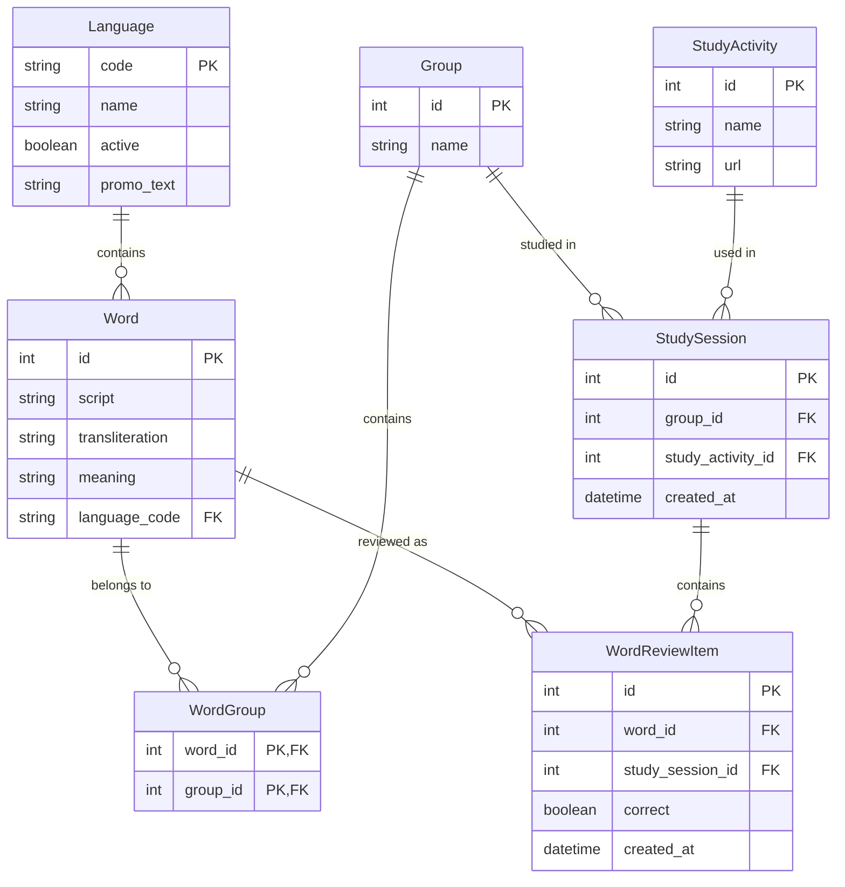

# BACK-END SPECIFICATION

## 1. Title & Overview

This document outlines the **FastAPI + SQLite** back-end for our multi-language learning portal.  
It describes the project structure, database models, endpoints, and a seed/reset mechanism  
to help maintain consistent test data across environments.

## 2. Project Structure (Diagram)

backend/
├── app/
│   ├── main.py           # FastAPI entry point
│   ├── db.py             # SQLite connection & session creation
│   ├── models.py         # SQLAlchemy models
│   ├── schemas.py        # Pydantic models (optional, for request/response)
│   ├── routers/
│   │   ├── languages.py  # Language endpoints
│   │   ├── words.py
│   │   ├── groups.py
│   │   ├── activities.py
│   │   ├── sessions.py
│   │   └── dashboard.py
│   ├── seed.py           # Data seeding script
│   └── utils.py          # Helper functions
├── requirements.txt
└── README.md

## 3. Data Models


### Entity Relationship Diagram


We will use **SQLAlchemy** (with SQLite) for our ORM. Below are the main entities:

### 3.1 Language
- **code** (String, PK) – ISO 639-1 code, e.g., "ja", "fr", "es"  
- **name** (String, required) – e.g., "Japanese", "French", "Spanish"  
- **active** (Boolean, default True) – to enable/disable languages
- **promo_text** (String, optional) – Promotional description of the language

### 3.2 Word
- **id** (PK, auto-increment)  
- **script** (String, required) – the word in its original script  
- **transliteration** (String, optional) – romanization if needed  
- **meaning** (String, required) – English translation  
- **language_code** (FK → languages.code) – reference to Language

### 3.3 Group
- **id** (PK, auto-increment)  
- **name** (String, required)

### 3.4 WordGroup (Join Table)
- **word_id** (FK → words.id, PK part)  
- **group_id** (FK → groups.id, PK part)

### 3.5 StudyActivity
- **id** (PK, auto-increment)  
- **name** (String, required) – e.g., "Flashcards"  
- **url** (String, required) – the relative or absolute URL for the activity

### 3.6 StudySession
- **id** (PK, auto-increment)  
- **group_id** (FK → groups.id)  
- **study_activity_id** (FK → study_activities.id)  
- **created_at** (Timestamp, default now)

### 3.7 WordReviewItem
- **id** (PK, auto-increment)  
- **word_id** (FK → words.id)  
- **study_session_id** (FK → study_sessions.id)  
- **correct** (Boolean) – indicates whether the user got the word right  
- **created_at** (Timestamp, default now)


## 4. Endpoints & Logic

### 4.1 Languages
#### GET /languages
Retrieves a list of languages with optional filtering for active/inactive ones.

**Query Parameters:**
- `active` (optional): Boolean - filter active/inactive languages

**Response Format:**
```json
{
    "items": [
        {
            "code": "ja",
            "name": "Japanese",
            "active": true,
            "promo_text": "Explore the rich culture of Japan through its unique writing system..."
        },
        {
            "code": "fr",
            "name": "French",
            "active": true,
            "promo_text": "Delve into the elegant world of French language..."
        }
    ]
}
```

**Example Requests:**
```bash
# Get all languages
GET /languages

# Get only active languages
GET /languages?active=true

# Get inactive languages
GET /languages?active=false
``` 

### 4.2 Words Endpoints

##### GET /words
Retrieves a paginated list of words with their review statistics (aggregated correct/wrong counts).

**Query Parameters:**
- `language_code` (required): ISO 639-1 language code (e.g., "ja", "fr")
- `page` (optional): Page number, default: 1
- `per_page` (optional): Items per page, default: 10
- `sort_by` (optional): Field to sort by (script, transliteration, meaning, correct_count, wrong_count)
- `order` (optional): Sort order ("asc" or "desc"), default: "asc"

**Response Format:**
```json
{
    "total": 25,
    "items": [
        {
            "id": 1,
            "script": "食べる",
            "transliteration": "taberu",
            "meaning": "to eat",
            "language_code": "ja",
            "correct_count": 5,
            "wrong_count": 2
        },
        // ... more items
    ],
    "page": 1,
    "per_page": 10
}
```

**Example Requests:**
```bash
# Get first page of Japanese words
GET /words?language_code=ja

# Get second page with 5 items per page
GET /words?language_code=fr&page=2&per_page=5

# Get words sorted by correct answers
GET /words?language_code=ja&sort_by=correct_count&order=desc
```

##### GET /words/{word_id}
Retrieves detailed information about a specific word, including its groups and review statistics.

**Path Parameters:**
- `word_id` (required): Integer - The ID of the word

**Response Format:**
```json
{
    "id": 1,
    "script": "食べる",
    "transliteration": "taberu",
    "meaning": "to eat",
    "language_code": "ja",
    "stats": {
        "correct_count": 5,
        "wrong_count": 2
    },
    "groups": [
        {
            "id": 1,
            "name": "Core Verbs"
        },
        {
            "id": 3,
            "name": "Food & Drink"
        }
    ]
}
```

**Error Responses:**
- 404: Word not found
  ```json
  {
      "detail": "Word with id {word_id} not found"
  }
  ```

### 4.3 Groups

#### GET /groups
Retrieves a paginated list of groups with their word counts in specified language.

**Query Parameters:**
- `language_code` (required): ISO 639-1 language code (e.g., "ja", "fr")
- `page` (optional): Page number, default: 1
- `per_page` (optional): Items per page, default: 10
- `sort_by` (optional): Field to sort by (name, words_count)
- `order` (optional): Sort order ("asc" or "desc"), default: "asc"

**Response Format:**
```json
{
    "total": 12,
    "items": [
        {
            "id": 1,
            "name": "Core Verbs",
            "words_count": 50
        },
        {
            "id": 2,
            "name": "Food & Drink",
            "words_count": 30
        }
    ],
    "page": 1,
    "per_page": 10
}
```

#### GET /groups/{group_id}
Retrieves detailed information about a specific group and its words in the specified language.

**Path Parameters:**
- `group_id` (required): Integer - The ID of the group

**Query Parameters:**
- `language_code` (required): ISO 639-1 language code (e.g., "ja", "fr")
- `page` (optional): Page number for words list, default: 1
- `per_page` (optional): Items per page for words list, default: 10
- `sort_by` (optional): Field to sort words by (script, transliteration, meaning, correct_count, wrong_count)
- `order` (optional): Sort order ("asc" or "desc"), default: "asc"

**Response Format:**
```json
{
    "id": 1,
    "name": "Core Verbs",
    "words_count": 50,
    "words": {
        "items": [
            {
                "id": 1,
                "script": "食べる",
                "transliteration": "taberu",
                "meaning": "to eat",
                "language_code": "ja",
                "correct_count": 5,
                "wrong_count": 2
            }
        ],
        "page": 1,
        "per_page": 10
    }
}
```

**Error Responses:**
- 404: Group not found
  ```json
  {
      "detail": "Group with id {group_id} not found"
  }
  ```

### 4.4 Study Activities
- **GET /study_activities**  
  - Returns a list of all activities (id, name, url)  
- **GET /study_activities/:id**  
  - Detail if needed (e.g., references to past sessions)

### 4.5 Study Sessions
- **POST /study_sessions**  
  - Body: { "group_id": int, "study_activity_id": int }  
  - Creates a new session record  
- **POST /study_sessions/:id/review**  
  - Body: { "word_id": int, "correct": bool }  
  - Inserts a word_review_item for that session  
- **GET /sessions**  
  - Paginated list of all sessions  
- **GET /sessions/:id**  
  - Shows details of a specific session (words reviewed, correct/wrong)

### 4.6 Dashboard
- **GET /dashboard/last_study_session**  
- **GET /dashboard/study_progress**  
- **GET /dashboard/quick_stats**  

Implementation examples:
- **last_study_session**: fetch the most recent `study_sessions` record, join with groups/activities, and aggregate correct vs. wrong from `word_review_items`.
- **study_progress**: compare total words in DB vs. how many the user has answered at least once (or show mastery).
- **quick_stats**: overall success rate, daily streak, etc.

## 5. Seed & Reset

### 5.1 Seed Data (seed.py)
- Insert default languages (e.g., "ja", "fr", "ar" with their names)
- Insert sample words in various languages (e.g., Japanese, Arabic, French).
- Create default groups ("Core Verbs", "Common Phrases"), link some words via `word_groups`.
- Create sample activities ("Flashcards", "Typing Tutor").

### 5.2 Reset Mechanism
- Could expose an endpoint like `POST /admin/reset` or a CLI that:
  1. Clears session & review tables  
  2. Re-inserts the seed data  
- The front-end "Reset Data" button (in Settings) can call this to restore a baseline state.

## 6. Implementation Tips

- **SQLite**:  
  - For dev, store in a local file (e.g. `db.sqlite3`). For testing, could use in-memory (`:memory:`).
- **Language Support**:
  - Always validate language_code against Languages table
  - Use language_code as query filter in Words endpoints
- **Pagination**:  
  - Combine `limit` + `offset`, or a library, returning { page, per_page, total, data }.
- **Performance**:  
  - For correct_count/wrong_count, either do subqueries each time or maintain counters. 
- **PyTest** for unit/integration tests, optionally with an in-memory DB.

## 7. Summary

A **FastAPI + SQLite** back end provides the REST endpoints needed by the front end.  
By following these specs (models, routes, seed/reset logic), developers or AI code generators can produce a robust server that manages multi-language words, groups, sessions, and aggregated stats for each user's study progress.
